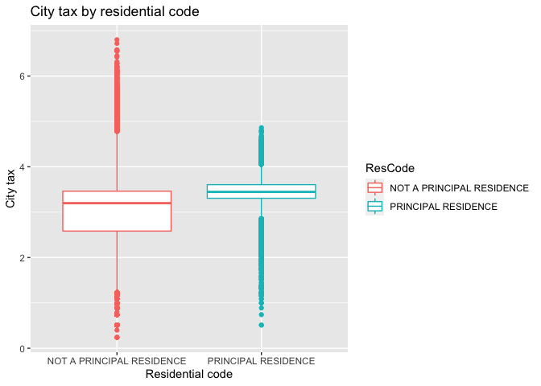
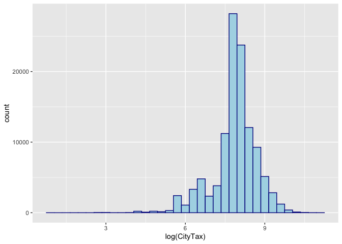
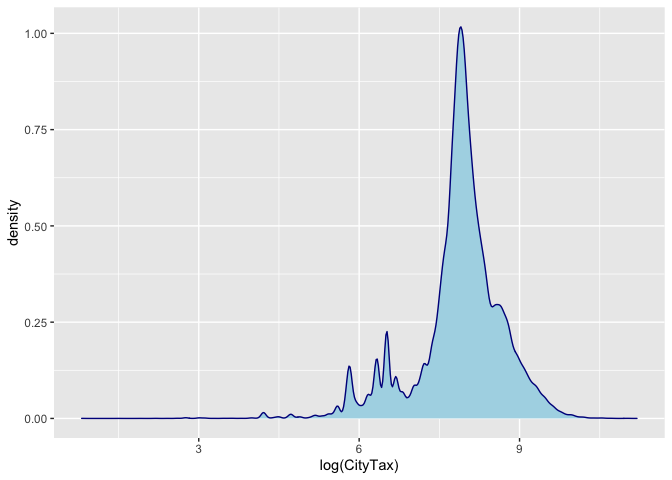
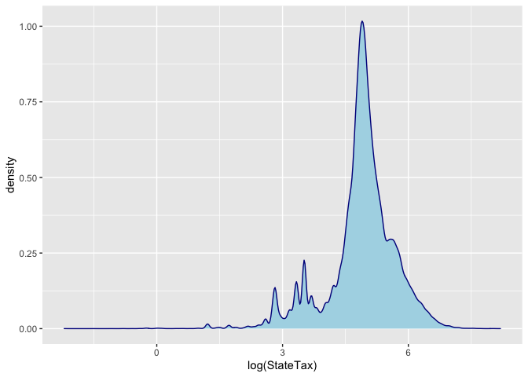
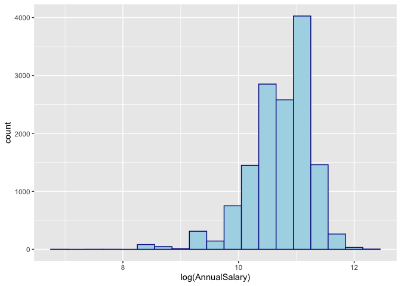

Data Cleaning in R
================
Sayorn Chin
06/09/2021

### Load required libraries

``` r
load_libraries <- function(){
  library(readr)
  library(tidyverse)
  library(dplyr)
  library(lubridate)
  library(broom)
  library(ggplot2)
  print('The libraries have been loaded.')
}
load_libraries()
```

    ## [1] "The libraries have been loaded."

### Section I

#### Load bike dataset

``` r
setwd('/Users/schinlfc/data-science-R/data-cleaning-R/data/')
bike = read_csv('bike_lanes.csv')
```

##### 1. Inspect the entire dataset

``` r
str(bike) 
```

    ## spec_tbl_df [1,631 × 9] (S3: spec_tbl_df/tbl_df/tbl/data.frame)
    ##  $ subType      : chr [1:1631] NA NA NA NA ...
    ##  $ name         : chr [1:1631] NA NA NA "HUNTINGDON PATH" ...
    ##  $ block        : chr [1:1631] NA NA NA NA ...
    ##  $ type         : chr [1:1631] "BIKE BOULEVARD" "SIDEPATH" "SIGNED ROUTE" "SIDEPATH" ...
    ##  $ numLanes     : num [1:1631] 1 1 1 1 1 2 2 2 1 1 ...
    ##  $ project      : chr [1:1631] "GUILFORD AVE BIKE BLVD" NA "SOUTHEAST BIKE NETWORK" NA ...
    ##  $ route        : chr [1:1631] NA "NORTHERN" NA NA ...
    ##  $ length       : num [1:1631] 436 1025 3749 0 181 ...
    ##  $ dateInstalled: num [1:1631] 0 2010 2010 0 2011 ...
    ##  - attr(*, "spec")=
    ##   .. cols(
    ##   ..   subType = col_character(),
    ##   ..   name = col_character(),
    ##   ..   block = col_character(),
    ##   ..   type = col_character(),
    ##   ..   numLanes = col_double(),
    ##   ..   project = col_character(),
    ##   ..   route = col_character(),
    ##   ..   length = col_double(),
    ##   ..   dateInstalled = col_double()
    ##   .. )

``` r
summary(bike) 
```

    ##    subType              name              block               type          
    ##  Length:1631        Length:1631        Length:1631        Length:1631       
    ##  Class :character   Class :character   Class :character   Class :character  
    ##  Mode  :character   Mode  :character   Mode  :character   Mode  :character  
    ##                                                                             
    ##                                                                             
    ##                                                                             
    ##     numLanes       project             route               length      
    ##  Min.   :0.000   Length:1631        Length:1631        Min.   :   0.0  
    ##  1st Qu.:1.000   Class :character   Class :character   1st Qu.: 124.0  
    ##  Median :1.000   Mode  :character   Mode  :character   Median : 200.3  
    ##  Mean   :1.422                                         Mean   : 269.4  
    ##  3rd Qu.:2.000                                         3rd Qu.: 341.0  
    ##  Max.   :2.000                                         Max.   :3749.3  
    ##  dateInstalled 
    ##  Min.   :   0  
    ##  1st Qu.:2007  
    ##  Median :2010  
    ##  Mean   :1854  
    ##  3rd Qu.:2010  
    ##  Max.   :2013

``` r
names(bike) 
```

    ## [1] "subType"       "name"          "block"         "type"         
    ## [5] "numLanes"      "project"       "route"         "length"       
    ## [9] "dateInstalled"

``` r
ncol(bike) 
```

    ## [1] 9

``` r
nrow(bike) 
```

    ## [1] 1631

``` r
sum(complete.cases(bike))
```

    ## [1] 257

``` r
sum(!complete.cases(bike)) 
```

    ## [1] 1374

##### 2. Create a data set called `namat` which is equal to `is.na(bike)`. What is the class of `namat`? Run rowSums and colSums on `namat.` These represent the number of missing values in the rows and columns of `bike`. Don’t print `rowSums`, but do a table of the `rowSums`. Try `nabike = bike %>% mutate_all(is.na)`. Then try `nabike %>% summarise_all(sum)`. What do you get?

``` r
namat <- is.na(bike)
class(namat)
```

    ## [1] "matrix" "array"

``` r
table(rowSums(namat))
```

    ## 
    ##    0    1    2    3    4 
    ##  257 1181  182    6    5

``` r
colSums(namat)
```

    ##       subType          name         block          type      numLanes 
    ##             4            12           215             9             0 
    ##       project         route        length dateInstalled 
    ##            74          1269             0             0

``` r
nabike <- bike %>% mutate_all(is.na)
print(nabike)
```

    ## # A tibble: 1,631 x 9
    ##    subType name  block type  numLanes project route length dateInstalled
    ##    <lgl>   <lgl> <lgl> <lgl> <lgl>    <lgl>   <lgl> <lgl>  <lgl>        
    ##  1 TRUE    TRUE  TRUE  FALSE FALSE    FALSE   TRUE  FALSE  FALSE        
    ##  2 TRUE    TRUE  TRUE  FALSE FALSE    TRUE    FALSE FALSE  FALSE        
    ##  3 TRUE    TRUE  TRUE  FALSE FALSE    FALSE   TRUE  FALSE  FALSE        
    ##  4 TRUE    FALSE TRUE  FALSE FALSE    TRUE    TRUE  FALSE  FALSE        
    ##  5 FALSE   FALSE FALSE FALSE FALSE    FALSE   TRUE  FALSE  FALSE        
    ##  6 FALSE   FALSE FALSE FALSE FALSE    FALSE   FALSE FALSE  FALSE        
    ##  7 FALSE   FALSE FALSE FALSE FALSE    FALSE   FALSE FALSE  FALSE        
    ##  8 FALSE   FALSE FALSE FALSE FALSE    FALSE   FALSE FALSE  FALSE        
    ##  9 FALSE   TRUE  TRUE  FALSE FALSE    FALSE   TRUE  FALSE  FALSE        
    ## 10 FALSE   TRUE  TRUE  FALSE FALSE    FALSE   TRUE  FALSE  FALSE        
    ## # … with 1,621 more rows

``` r
print(nabike %>% summarise_all(sum))
```

    ## # A tibble: 1 x 9
    ##   subType  name block  type numLanes project route length dateInstalled
    ##     <int> <int> <int> <int>    <int>   <int> <int>  <int>         <int>
    ## 1       4    12   215     9        0      74  1269      0             0

##### 3. Filter rows of bike that are NOT missing the `route` variable, assign this to the object `have_route.` Do a table of the `subType` using `table`, including the missing `subType`s Get the same frequency distribution using `group_by(subType)` and `tally()`

``` r
have_route <- bike %>% filter(!is.na(route))
print(have_route)
```

    ## # A tibble: 362 x 9
    ##    subType name    block    type   numLanes project   route length dateInstalled
    ##    <chr>   <chr>   <chr>    <chr>     <dbl> <chr>     <chr>  <dbl>         <dbl>
    ##  1 <NA>    <NA>    <NA>     SIDEP…        1 <NA>      NORT… 1025.           2010
    ##  2 STRALY  WINSTO… 1200 BL… SIGNE…        2 COLLEGET… COLL…  148.           2007
    ##  3 STRALY  WINSTO… 1200 BL… SIGNE…        2 COLLEGET… COLL…  366.           2007
    ##  4 STRALY  WINSTO… 1200 BL… SIGNE…        2 COLLEGET… COLL…  262.           2007
    ##  5 STRPRD  <NA>    <NA>     SIGNE…        1 COLLEGET… COLL…   49.3          2007
    ##  6 STRPRD  <NA>    <NA>     SIGNE…        1 COLLEGET… COLL…   70.0          2007
    ##  7 STRPRD  <NA>    <NA>     SIGNE…        1 COLLEGET… COLL…  765.           2007
    ##  8 STRPRD  <NA>    <NA>     SIGNE…        2 COLLEGET… COLL…  170.           2007
    ##  9 STRPRD  <NA>    <NA>     SIGNE…        2 COLLEGET… COLL… 1724.           2007
    ## 10 STRPRD  ALBEMA… 100 BLK… SIGNE…        1 SOUTHEAS… LITT…  250.           2011
    ## # … with 352 more rows

``` r
table(bike$subType, useNA='always')
```

    ## 
    ##  STCLN STRALY STRPRD   <NA> 
    ##      1      3   1623      4

``` r
print(have_route %>% group_by(subType) %>% tally())
```

    ## # A tibble: 3 x 2
    ##   subType     n
    ##   <chr>   <int>
    ## 1 STRALY      3
    ## 2 STRPRD    358
    ## 3 <NA>        1

``` r
print(have_route %>%  count(subType))
```

    ## # A tibble: 3 x 2
    ##   subType     n
    ##   <chr>   <int>
    ## 1 STRALY      3
    ## 2 STRPRD    358
    ## 3 <NA>        1

``` r
print(have_route %>% group_by(subType) %>% summarize(n_obs = n()))
```

    ## # A tibble: 3 x 2
    ##   subType n_obs
    ##   <chr>   <int>
    ## 1 STRALY      3
    ## 2 STRPRD    358
    ## 3 <NA>        1

``` r
print(tally(group_by(have_route, subType)))
```

    ## # A tibble: 3 x 2
    ##   subType     n
    ##   <chr>   <int>
    ## 1 STRALY      3
    ## 2 STRPRD    358
    ## 3 <NA>        1

``` r
have_route = group_by(have_route, subType)
print(tally(have_route))
```

    ## # A tibble: 3 x 2
    ##   subType     n
    ##   <chr>   <int>
    ## 1 STRALY      3
    ## 2 STRPRD    358
    ## 3 <NA>        1

##### 4. Filter rows of bike that have the type `SIDEPATH` or `BIKE LANE` using `%in%`. Call it `side_bike.` Confirm this gives you the same number of results using the `|` and `==`.

``` r
side_bike <- bike %>% filter(type %in% c('SIDEPATH', 'BIKE LANE'))
print(side_bike)
```

    ## # A tibble: 628 x 9
    ##    subType name    block    type   numLanes project   route length dateInstalled
    ##    <chr>   <chr>   <chr>    <chr>     <dbl> <chr>     <chr>  <dbl>         <dbl>
    ##  1 <NA>    <NA>    <NA>     SIDEP…        1 <NA>      NORT… 1025.           2010
    ##  2 <NA>    HUNTIN… <NA>     SIDEP…        1 <NA>      <NA>     0               0
    ##  3 STCLN   EDMOND… 5300 BL… BIKE …        1 OPERATIO… <NA>   181.           2011
    ##  4 STRPRD  <NA>    <NA>     BIKE …        1 MAINTENA… <NA>   696.           2009
    ##  5 STRPRD  ARGONN… 2100 BL… BIKE …        2 ENGINEER… <NA>  1313.              0
    ##  6 STRPRD  AUCHEN… 3500 BL… BIKE …        1 <NA>      <NA>  1342.           2012
    ##  7 STRPRD  BANK ST <NA>     BIKE …        1 SOUTHEAS… <NA>    21.0          2010
    ##  8 STRPRD  BANK ST 3100 BL… BIKE …        2 SOUTHEAS… <NA>    91.8          2010
    ##  9 STRPRD  BANK ST 3100 BL… BIKE …        2 SOUTHEAS… <NA>    92.6          2010
    ## 10 STRPRD  BANK ST 3100 BL… BIKE …        2 SOUTHEAS… <NA>   106.           2010
    ## # … with 618 more rows

``` r
side_bike <- bike %>% filter(type == 'SIDEPATH' | type == 'BIKE LANE')
print(side_bike)
```

    ## # A tibble: 628 x 9
    ##    subType name    block    type   numLanes project   route length dateInstalled
    ##    <chr>   <chr>   <chr>    <chr>     <dbl> <chr>     <chr>  <dbl>         <dbl>
    ##  1 <NA>    <NA>    <NA>     SIDEP…        1 <NA>      NORT… 1025.           2010
    ##  2 <NA>    HUNTIN… <NA>     SIDEP…        1 <NA>      <NA>     0               0
    ##  3 STCLN   EDMOND… 5300 BL… BIKE …        1 OPERATIO… <NA>   181.           2011
    ##  4 STRPRD  <NA>    <NA>     BIKE …        1 MAINTENA… <NA>   696.           2009
    ##  5 STRPRD  ARGONN… 2100 BL… BIKE …        2 ENGINEER… <NA>  1313.              0
    ##  6 STRPRD  AUCHEN… 3500 BL… BIKE …        1 <NA>      <NA>  1342.           2012
    ##  7 STRPRD  BANK ST <NA>     BIKE …        1 SOUTHEAS… <NA>    21.0          2010
    ##  8 STRPRD  BANK ST 3100 BL… BIKE …        2 SOUTHEAS… <NA>    91.8          2010
    ##  9 STRPRD  BANK ST 3100 BL… BIKE …        2 SOUTHEAS… <NA>    92.6          2010
    ## 10 STRPRD  BANK ST 3100 BL… BIKE …        2 SOUTHEAS… <NA>   106.           2010
    ## # … with 618 more rows

##### 5. Do a cross tabulation of the bike `type` and the number of lanes. Call it `tab`. Do a `prop.table` on the rows and columns margins. Try `as.data.frame(tab)` or `broom::tidy(tab)`

``` r
tab <- table(bike_type = bike$type, number_of_lanes = bike$numLanes)
print(tab)
```

    ##                  number_of_lanes
    ## bike_type           0   1   2
    ##   BIKE BOULEVARD    0   1  48
    ##   BIKE LANE        20 411 190
    ##   CONTRAFLOW        0   7   6
    ##   SHARED BUS BIKE   0  39   0
    ##   SHARROW           0 217 372
    ##   SIDEPATH          0   6   1
    ##   SIGNED ROUTE      0 211  93

``` r
prop.table(tab, 1)
```

    ##                  number_of_lanes
    ## bike_type                  0          1          2
    ##   BIKE BOULEVARD  0.00000000 0.02040816 0.97959184
    ##   BIKE LANE       0.03220612 0.66183575 0.30595813
    ##   CONTRAFLOW      0.00000000 0.53846154 0.46153846
    ##   SHARED BUS BIKE 0.00000000 1.00000000 0.00000000
    ##   SHARROW         0.00000000 0.36842105 0.63157895
    ##   SIDEPATH        0.00000000 0.85714286 0.14285714
    ##   SIGNED ROUTE    0.00000000 0.69407895 0.30592105

``` r
prop.table(tab, 2)
```

    ##                  number_of_lanes
    ## bike_type                   0           1           2
    ##   BIKE BOULEVARD  0.000000000 0.001121076 0.067605634
    ##   BIKE LANE       1.000000000 0.460762332 0.267605634
    ##   CONTRAFLOW      0.000000000 0.007847534 0.008450704
    ##   SHARED BUS BIKE 0.000000000 0.043721973 0.000000000
    ##   SHARROW         0.000000000 0.243273543 0.523943662
    ##   SIDEPATH        0.000000000 0.006726457 0.001408451
    ##   SIGNED ROUTE    0.000000000 0.236547085 0.130985915

``` r
print(as.data.frame(tab))
```

    ##          bike_type number_of_lanes Freq
    ## 1   BIKE BOULEVARD               0    0
    ## 2        BIKE LANE               0   20
    ## 3       CONTRAFLOW               0    0
    ## 4  SHARED BUS BIKE               0    0
    ## 5          SHARROW               0    0
    ## 6         SIDEPATH               0    0
    ## 7     SIGNED ROUTE               0    0
    ## 8   BIKE BOULEVARD               1    1
    ## 9        BIKE LANE               1  411
    ## 10      CONTRAFLOW               1    7
    ## 11 SHARED BUS BIKE               1   39
    ## 12         SHARROW               1  217
    ## 13        SIDEPATH               1    6
    ## 14    SIGNED ROUTE               1  211
    ## 15  BIKE BOULEVARD               2   48
    ## 16       BIKE LANE               2  190
    ## 17      CONTRAFLOW               2    6
    ## 18 SHARED BUS BIKE               2    0
    ## 19         SHARROW               2  372
    ## 20        SIDEPATH               2    1
    ## 21    SIGNED ROUTE               2   93

``` r
print(broom::tidy(tab))
```

    ## # A tibble: 21 x 3
    ##    bike_type       number_of_lanes     n
    ##    <chr>           <chr>           <int>
    ##  1 BIKE BOULEVARD  0                   0
    ##  2 BIKE LANE       0                  20
    ##  3 CONTRAFLOW      0                   0
    ##  4 SHARED BUS BIKE 0                   0
    ##  5 SHARROW         0                   0
    ##  6 SIDEPATH        0                   0
    ##  7 SIGNED ROUTE    0                   0
    ##  8 BIKE BOULEVARD  1                   1
    ##  9 BIKE LANE       1                 411
    ## 10 CONTRAFLOW      1                   7
    ## # … with 11 more rows

### Section II

#### Load tax dataset

``` r
setwd('/Users/schinlfc/data-science-R/data-cleaning-R/data/')
tax <- read_csv('real_property_taxes.csv')
```

##### 6. How many addresses pay property taxes?

``` r
dim(tax)
```

    ## [1] 238298     16

``` r
nrow(tax)
```

    ## [1] 238298

``` r
length(tax$PropertyID)
```

    ## [1] 238298

``` r
sum(is.na(tax$CityTax))
```

    ## [1] 19052

``` r
sum(!is.na(tax$CityTax))
```

    ## [1] 219246

##### 7. What is the total city and state tax paid?

You need to remove the `$` from the `CityTax` variable then you need to
make it numeric. Try `str_replace`, but remember $ is “special” and you
need `fixed()` around it.

###### 7.1 City

``` r
head(tax$CityTax) 
```

    ## [1] "$3929.50" "$2697.60" "$5604.26" "$1852.35" "$2268.97" "$3903.27"

``` r
tax <- tax %>% 
  mutate(CityTax = str_replace(CityTax, fixed("$"), ""),
  CityTax = as.numeric(CityTax))
head(tax$CityTax)
```

    ## [1] 3929.50 2697.60 5604.26 1852.35 2268.97 3903.27

``` r
tax$CityTax <- str_replace(tax$CityTax, fixed("$"), "")
tax$CityTax <- as.numeric(tax$CityTax)
head(tax$CityTax)
```

    ## [1] 3929.50 2697.60 5604.26 1852.35 2268.97 3903.27

``` r
sum(is.na(tax$CityTax))
```

    ## [1] 19052

``` r
options(digits=12) # so no rounding
sum(tax$CityTax, na.rm = TRUE)
```

    ## [1] 859700558.94

``` r
sum(tax$CityTax, na.rm = TRUE) / 1e6
```

    ## [1] 859.70055894

###### 7.2 State

``` r
options(digits=12) # so no rounding
head(tax$StateTax)
```

    ## [1] "$195.78" "$134.40" "$279.22" "$92.29"  "$113.04" "$194.47"

``` r
tax <- tax %>% mutate(StateTax = parse_number(StateTax))
head(tax$StateTax)
```

    ## [1] 195.78 134.40 279.22  92.29 113.04 194.47

``` r
sum(is.na(tax$StateTax))
```

    ## [1] 18853

``` r
sum(tax$StateTax, na.rm = TRUE)
```

    ## [1] 43484914.8

``` r
sum(tax$StateTax, na.rm = TRUE) / 1e6
```

    ## [1] 43.4849148

##### 8. Using `table()` or `group_by` and `summarize(n())` or `tally()`

###### 8.1 how many observations/properties are in each Ward?

``` r
table(tax$Ward)
```

    ## 
    ##    01    02    03    04    05    06    07    08    09    10    11    12    13 
    ##  6619  3547  2541  1731   465  4505  4903 11445 11833  1704  3592  8864  9459 
    ##    14    15    16    17    18    19    20    21    22    23    24    25    26 
    ##  3113 18655 11286  1454  2310  3833 11927  3181  1719  2567  6116 14841 25704 
    ##    27    28    50 
    ## 50158 10219     7

``` r
ward_table <- tax %>% group_by(Ward) %>% tally()
print(ward_table)
```

    ## # A tibble: 29 x 2
    ##    Ward      n
    ##    <chr> <int>
    ##  1 01     6619
    ##  2 02     3547
    ##  3 03     2541
    ##  4 04     1731
    ##  5 05      465
    ##  6 06     4505
    ##  7 07     4903
    ##  8 08    11445
    ##  9 09    11833
    ## 10 10     1704
    ## # … with 19 more rows

``` r
ward_table <- tax %>% group_by(Ward) %>%
  summarise(number_of_observations = n())
print(ward_table)
```

    ## # A tibble: 29 x 2
    ##    Ward  number_of_observations
    ##    <chr>                  <int>
    ##  1 01                      6619
    ##  2 02                      3547
    ##  3 03                      2541
    ##  4 04                      1731
    ##  5 05                       465
    ##  6 06                      4505
    ##  7 07                      4903
    ##  8 08                     11445
    ##  9 09                     11833
    ## 10 10                      1704
    ## # … with 19 more rows

###### 8.2 what is the mean state tax per Ward? use `group_by` and \`summarize

``` r
mean_statetax <- tax %>% group_by(Ward) %>%
  summarise(mean_statetax = mean(StateTax, na.rm = TRUE))
print(mean_statetax)
```

    ## # A tibble: 29 x 2
    ##    Ward  mean_statetax
    ##    <chr>         <dbl>
    ##  1 01            301. 
    ##  2 02            369. 
    ##  3 03            879. 
    ##  4 04           2442. 
    ##  5 05            356. 
    ##  6 06            178. 
    ##  7 07             95.9
    ##  8 08             51.7
    ##  9 09             86.5
    ## 10 10             74.1
    ## # … with 19 more rows

###### 8.3 what is the maximum amount still due in each Ward? different summarization (`max`)

``` r
tax <- tax %>% mutate(AmountDue = str_replace(
  AmountDue, fixed("$"), ""), AmountDue = as.numeric(AmountDue))
head(tax$AmountDue)
```

    ## [1]   19.70 2818.51   28.02      NA 1975.88 3935.38

``` r
tax$AmountDue = tax$AmountDue %>% 
  str_replace(fixed("$"), "") %>%
  as.numeric
head(tax$AmountDue)
```

    ## [1]   19.70 2818.51   28.02      NA 1975.88 3935.38

``` r
tax = tax %>% mutate(AmountDue = as.numeric(str_replace(
    AmountDue, fixed("$"), "")))
head(tax$AmountDue)
```

    ## [1]   19.70 2818.51   28.02      NA 1975.88 3935.38

``` r
max_due <- tax %>% group_by(Ward) %>% 
  summarise(max_amount_due = max(AmountDue, na.rm = TRUE))
print(max_due)
```

    ## # A tibble: 29 x 2
    ##    Ward  max_amount_due
    ##    <chr>          <dbl>
    ##  1 01           627349.
    ##  2 02          1452842.
    ##  3 03          1362318.
    ##  4 04          3688217.
    ##  5 05           951087.
    ##  6 06           414725.
    ##  7 07          1239508.
    ##  8 08           396504.
    ##  9 09           155496.
    ## 10 10           169659.
    ## # … with 19 more rows

###### 8.4 what is the 75th percentile of city and state tax paid by Ward? (`quantile`)

``` r
percentile_city <- tax %>% group_by(Ward) %>% 
  summarise(percentile_city = quantile(
    CityTax, prob = 0.75, na.rm = TRUE))
print(percentile_city)
```

    ## # A tibble: 29 x 2
    ##    Ward  percentile_city
    ##    <chr>           <dbl>
    ##  1 01              6420.
    ##  2 02              6603.
    ##  3 03              6209.
    ##  4 04             11304.
    ##  5 05              2566.
    ##  6 06              3969.
    ##  7 07               869.
    ##  8 08              1479.
    ##  9 09              2653.
    ## 10 10              1664.
    ## # … with 19 more rows

``` r
percential_state <- tax %>% group_by(Ward) %>%
  summarise(percential_state = quantile(
    StateTax, prob = 0.75, na.rm = TRUE))
print(percential_state)
```

    ## # A tibble: 29 x 2
    ##    Ward  percential_state
    ##    <chr>            <dbl>
    ##  1 01               320. 
    ##  2 02               329. 
    ##  3 03               311. 
    ##  4 04               582. 
    ##  5 05               128. 
    ##  6 06               198. 
    ##  7 07                43.3
    ##  8 08                73.7
    ##  9 09               132. 
    ## 10 10                82.9
    ## # … with 19 more rows

``` r
percentile_city_state <- tax %>% 
  group_by(Ward) %>% summarise(
    percentile_city = quantile(CityTax, prob = 0.75, na.rm =TRUE),
    percentile_state = quantile(StateTax, prob = 0.75, na.rm =TRUE))
print(percentile_city_state)
```

    ## # A tibble: 29 x 3
    ##    Ward  percentile_city percentile_state
    ##    <chr>           <dbl>            <dbl>
    ##  1 01              6420.            320. 
    ##  2 02              6603.            329. 
    ##  3 03              6209.            311. 
    ##  4 04             11304.            582. 
    ##  5 05              2566.            128. 
    ##  6 06              3969.            198. 
    ##  7 07               869.             43.3
    ##  8 08              1479.             73.7
    ##  9 09              2653.            132. 
    ## 10 10              1664.             82.9
    ## # … with 19 more rows

##### 9. Make boxplots using showing `cityTax` (`y` -variable) by whether the property is a principal residence (`x`) or not.

``` r
tax <- tax %>% mutate(CityTax = as.numeric(str_replace(CityTax, fixed("$"), "")),
                      ResCode = str_trim(ResCode))

ggplot(tax, aes(x=ResCode, y=log10(CityTax+1), color=ResCode)) +
  geom_boxplot() +
  labs(title="City tax by residential code") +
  xlab("Residential code") +
  ylab("City tax")
```

<!-- -->

##### 10. Subset the data to only retain those houses that are principal residences. Which command subsets rows? Filter or select?

###### 10.1 How many such houses are there?

``` r
pres = tax %>% filter( ResCode %in% "PRINCIPAL RESIDENCE")
nrow(pres)
```

    ## [1] 113592

``` r
pres = tax %>% filter( ResCode == "PRINCIPAL RESIDENCE")
nrow(pres)
```

    ## [1] 113592

###### 10.2 Describe the distribution of property taxes on these residences.

``` r
pres <- pres %>% mutate(StateTax = as.numeric(str_replace(StateTax, fixed("$"), "")))

ggplot(pres, aes(x=log(CityTax))) + 
  geom_histogram(binwidth=0.3, color="darkblue",
  fill="lightblue")
```

<!-- -->

``` r
ggplot(pres, aes(x=log(CityTax)))+
  geom_density(color="darkblue", fill="lightblue")
```

<!-- -->

``` r
ggplot(pres, aes(x=log(StateTax))) + 
  geom_histogram(binwidth=0.3, color="darkblue",
  fill="lightblue")
```

<!-- -->

``` r
ggplot(pres, aes(x=log(StateTax)))+
  geom_density(color="darkblue", fill="lightblue")
```

<!-- -->

### Section III

#### Load salary dataset

``` r
setwd('/Users/schinlfc/data-science-R/data-cleaning-R/data/')
sal <- read_csv('baltimore_city_employee_salaries_FY2015.csv')
```

##### 11. Make an object called health.sal using the salaries data set, with only agencies of those with `"fire"` (or any forms), if any, in the name remember `fixed( ignore_case = TRUE)` will ignore cases.

``` r
health.sal <- sal %>% filter(str_detect(Agency, fixed("fire", ignore_case = TRUE)))
print(head(health.sal))
```

    ## # A tibble: 6 x 7
    ##   name       JobTitle        AgencyID Agency      HireDate AnnualSalary GrossPay
    ##   <chr>      <chr>           <chr>    <chr>       <chr>    <chr>        <chr>   
    ## 1 Abdal-Rah… EMT Firefighte… A64120   Fire Depar… 03/30/2… $62175.00    $83757.…
    ## 2 Abler II,… PARAMEDIC CRT   A64465   Fire Depar… 03/20/2… $65480.00    $104095…
    ## 3 Acree,Enn… Fire Pump Oper… A64131   Fire Depar… 10/07/2… $70388.00    $70859.…
    ## 4 Adamczyk,… PARAMEDIC CRT   A64465   Fire Depar… 01/18/2… $67749.00    $78206.…
    ## 5 Adams,Jen… PARAMEDIC EMT-P A64464   Fire Depar… 11/10/2… $65954.00    $73100.…
    ## 6 Adams,Sho… Firefighter/Pa… A64225   Fire Depar… 07/12/1… $70753.00    $79266.…

##### 12. Make a data set called `trans` which contains only agencies that contain “TRANS”.

``` r
trans <- sal %>% filter(str_detect(Agency, "TRANS"))
print(head(trans))
```

    ## # A tibble: 6 x 7
    ##   name       JobTitle        AgencyID Agency      HireDate AnnualSalary GrossPay
    ##   <chr>      <chr>           <chr>    <chr>       <chr>    <chr>        <chr>   
    ## 1 Abbott-Co… CONTRACT SERV … A90005   TRANS-Traf… 11/28/2… $42702.00    $20250.…
    ## 2 Abendsche… OFFICE SUPERVI… A90002   TRANS-Traf… 07/19/1… $48331.00    $54595.…
    ## 3 Abual Gas… CROSSING GUARD  C90786   TRANS-Cros… 11/22/2… $10546.00    $10594.…
    ## 4 Abu-Hakim… ELECTRICAL MEC… A49390   TRANS-High… 01/09/2… $35420.00    $70115.…
    ## 5 Adabah,Fr… STOREKEEPER II  A49320   TRANS-High… 03/30/2… $30834.00    $6907.73
    ## 6 Adams,Jud… CROSSING GUARD  C90786   TRANS-Cros… 06/02/1… $11467.00    $11423.…

##### 13. What is/are the profession(s) of people who have `"abra"` in their name for Baltimore’s Salaries? Case should be ignored.

``` r
print(sal %>% 
  filter(str_detect(name, fixed("abra", ignore_case = TRUE))) %>% select(name, JobTitle))
```

    ## # A tibble: 12 x 2
    ##    name               JobTitle                      
    ##    <chr>              <chr>                         
    ##  1 Abraham,Donta D    LABORER (Hourly)              
    ##  2 Abraham,Santhosh   ACCOUNTANT I                  
    ##  3 Abraham,Sharon M   HOUSING INSPECTOR             
    ##  4 Abrahams,Brandon A POLICE OFFICER TRAINEE        
    ##  5 Abrams,Maria       OFFICE SERVICES ASSISTANT II S
    ##  6 Abrams,Maxine      COLLECTIONS REPRESENTATIVE I  
    ##  7 Abrams,Terry       RECREATION ARTS INSTRUCTOR    
    ##  8 Bey,Abraham        PROCUREMENT SPECIALIST II     
    ##  9 Elgamil,Abraham D  AUDITOR SUPV                  
    ## 10 Gatto,Abraham M    POLICE OFFICER                
    ## 11 Schwartz,Abraham M GENERAL COUNSEL               
    ## 12 Velez,Abraham L    POLICE OFFICER (EID)

##### 14. What is the distribution of annual salaries look like? (use `hist`) What is the IQR? Hint: first convert to numeric. Try `str_replace`, but remember`$` is “special” and you need `fixed()` around it.

``` r
sal <- sal %>% 
  mutate(AnnualSalary = as.numeric(
  str_replace(AnnualSalary, fixed("$"), "")))
print(head(sal))
```

    ## # A tibble: 6 x 7
    ##   name       JobTitle       AgencyID Agency       HireDate AnnualSalary GrossPay
    ##   <chr>      <chr>          <chr>    <chr>        <chr>           <dbl> <chr>   
    ## 1 Aaron,Pat… Facilities/Of… A03031   OED-Employm… 10/24/1…        55314 $53626.…
    ## 2 Aaron,Pet… ASSISTANT STA… A29045   States Atto… 09/25/2…        74000 $73000.…
    ## 3 Abaineh,Y… EPIDEMIOLOGIST A65026   HLTH-Health… 07/23/2…        64500 $64403.…
    ## 4 Abbene,An… POLICE OFFICER A99005   Police Depa… 07/24/2…        46309 $59620.…
    ## 5 Abbey,Emm… CONTRACT SERV… A40001   M-R Info Te… 05/01/2…        60060 $54059.…
    ## 6 Abbott-Co… CONTRACT SERV… A90005   TRANS-Traff… 11/28/2…        42702 $20250.…

``` r
ggplot(sal, aes(x=log(AnnualSalary))) + 
  geom_histogram(binwidth=0.3, color="darkblue",
  fill="lightblue")
```

<!-- -->
